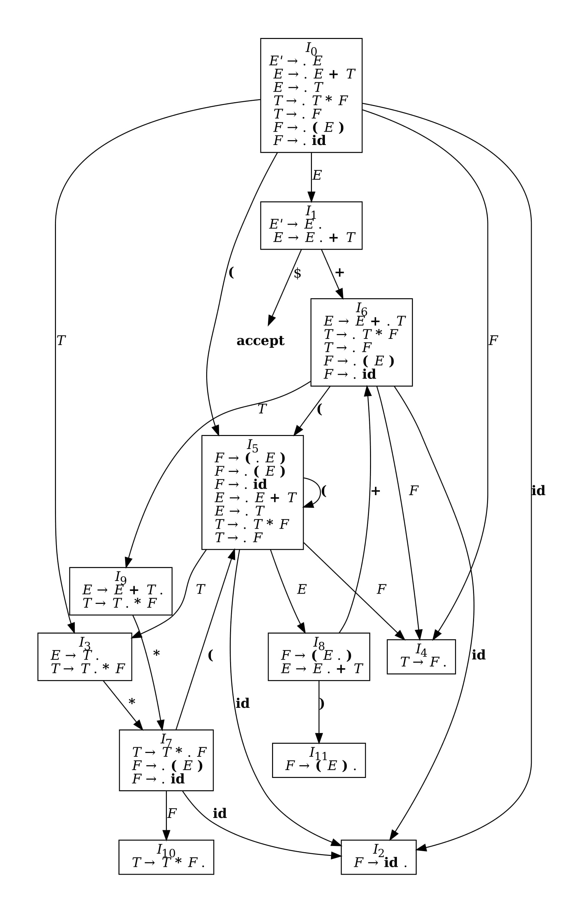

# SLR Parser

An implementation of a Simple LR (SLR) parser for educational purposes.

```
$ slr -g grammar.txt "id * id + id"
AUGMENTED GRAMMAR:
0: E' -> E
1:  E -> E + T
2:  E -> T
3:  T -> T * F
4:  T -> F
5:  F -> ( E )
6:  F -> id

   TERMINALS: *, id, +, ), (
NONTERMINALS: E, E', T, F
     SYMBOLS: *, E, id, E', +, ), T, F, (

FIRST:
E' = { (, id }
 E = { id, ( }
 T = { (, id }
 F = { id, ( }

FOLLOW:
E' = { $ }
 E = { $, +, ) }
 T = { *, +, ), $ }
 F = { *, +, ), $ }

PARSING TABLE:
+--------+--------+--------+--------+--------+--------+--------+--------+--------+--------+
|        |                       ACTION                        |           GOTO           |
| STATE  +--------+--------+--------+--------+--------+--------+--------+--------+--------+
|        |    *   |   id   |    +   |    )   |    (   |    $   |    E   |    T   |    F   |
+--------+--------+--------+--------+--------+--------+--------+--------+--------+--------+
|   0    |        |   s2   |        |        |   s5   |        |    1   |    3   |    4   |
|   1    |        |        |   s6   |        |        |   acc  |        |        |        |
|   2    |   r6   |        |   r6   |   r6   |        |   r6   |        |        |        |
|   3    |   s7   |        |   r2   |   r2   |        |   r2   |        |        |        |
|   4    |   r4   |        |   r4   |   r4   |        |   r4   |        |        |        |
|   5    |        |   s2   |        |        |   s5   |        |    8   |    3   |    4   |
|   6    |        |   s2   |        |        |   s5   |        |        |    9   |    4   |
|   7    |        |   s2   |        |        |   s5   |        |        |        |   10   |
|   8    |        |        |   s6   |   s11  |        |        |        |        |        |
|   9    |   s7   |        |   r1   |   r1   |        |   r1   |        |        |        |
|   10   |   r3   |        |   r3   |   r3   |        |   r3   |        |        |        |
|   11   |   r5   |        |   r5   |   r5   |        |   r5   |        |        |        |
+--------+--------+--------+--------+--------+--------+--------+--------+--------+--------+

+------+----------+---------+----------------+----------------------+
|      |  STACK   | SYMBOLS |     INPUT      |        ACTION        |
+------+----------+---------+----------------+----------------------+
|  (1) | 0        |         | id * id + id $ | shift                |
|  (2) | 0 2      | id      |    * id + id $ | reduce by F -> id    |
|  (3) | 0 4      | F       |    * id + id $ | reduce by T -> F     |
|  (4) | 0 3      | T       |    * id + id $ | shift                |
|  (5) | 0 3 7    | T *     |      id + id $ | shift                |
|  (6) | 0 3 7 2  | T * id  |         + id $ | reduce by F -> id    |
|  (7) | 0 3 7 10 | T * F   |         + id $ | reduce by T -> T * F |
|  (8) | 0 3      | T       |         + id $ | reduce by E -> T     |
|  (9) | 0 1      | E       |         + id $ | shift                |
| (10) | 0 1 6    | E +     |           id $ | shift                |
| (11) | 0 1 6 2  | E + id  |              $ | reduce by F -> id    |
| (12) | 0 1 6 4  | E + F   |              $ | reduce by T -> F     |
| (13) | 0 1 6 9  | E + T   |              $ | reduce by E -> E + T |
| (14) | 0 1      | E       |              $ | accept               |
+------+----------+---------+----------------+----------------------+
```

<p align="center">
  
  <br/>
</p>

# Installation

## Requirements

* Python 3.12+

## Stable release

To install slr-parser, run this command in your terminal:

```
pip install slr-parser
```

This is the preferred method to install slr-parser, as it will always install the most recent stable release.

If you don't have [pip](https://pip.pypa.io) installed,
this [Python installation guide](http://docs.python-guide.org/en/latest/starting/installation/) can guide you through
the process.

## From sources

The sources for slr-parser can be downloaded from the [Github repo](https://github.com/Vipul97/slr-parser).

You can either clone the public repository:

```
git clone git://github.com/Vipul97/slr-parser
```

Or download the [tarball](https://github.com/Vipul97/slr-parser/tarball/master):

```
curl -OJL https://github.com/Vipul97/slr-parser/tarball/master
```

Once you have a copy of the source, you can install it with:

```
python setup.py install
```

# Usage

## Grammar Syntax

* Each production rule is written with the head and body separated by ```->```.
* Nonterminals are capitalized (e.g., ```E```, ```T```); terminals are not (e.g., ```id```, ```+```).
* Symbols in the body of the production are separated by spaces. For multi-character symbols, spaces are omitted (e.g.,
  ```id```).
* The choice operator ```|``` can be used to separate alternatives in the body.
* The null symbol is represented by ```^```.

## Grammar File

The grammar should be provided in a text file. Here's an example ```grammar.txt```:

```
E -> E + T
E -> T
T -> T * F | F
F -> ( E )
F -> id
```

## Tokens

The input tokens must be enclosed in double quotes and separated by spaces. For example: ```"id * id + id"```.

    usage: slr [-h] [-g] grammar_file tokens

    positional arguments:
      grammar_file  Path to the text file used as grammar
      tokens        Tokens to be parsed, separated by spaces

    optional arguments:
      -h, --help    show this help message and exit
      -g            Generate automaton

# Contributing

Please read [CONTRIBUTING.md](CONTRIBUTING.md) for details on code of conduct, and the process for submitting pull
requests.

# License

This project is licensed under the MIT License - see the [LICENSE](LICENSE) file for details.
